#IMPLEMENTATION OF CLIENT SERVER ARCHITECTURE USING MYSQL DATABASE MANAGEMENT SYSTEM (PROJECT 5)

1.a Create MySql Server

(http://ec2-54-89-205-122.compute-1.amazonaws.com)

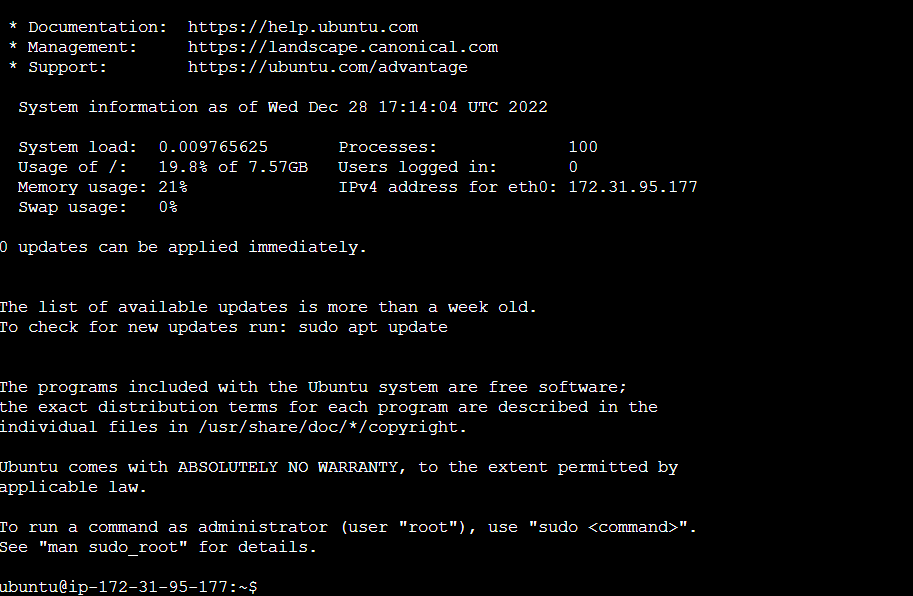

`sudo apt install apache2`

b Create MySql Client

(http://ec2-18-234-102-46.compute-1.amazonaws.com)

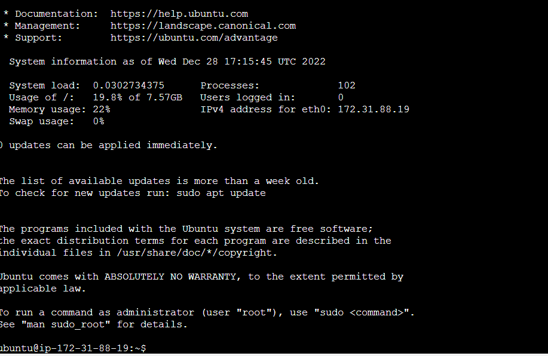

`sudo apt install apache2`

2. In 1.a install Mysql Server

`sudo apt install mysql-server`

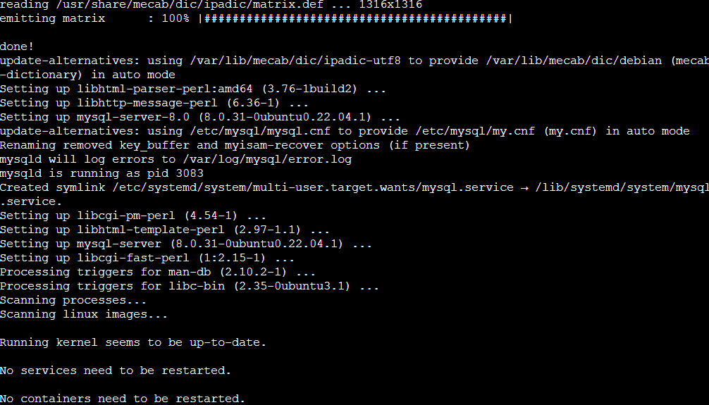

3. In 1.b install Mysql Client

`sudo apt install mysql-client`

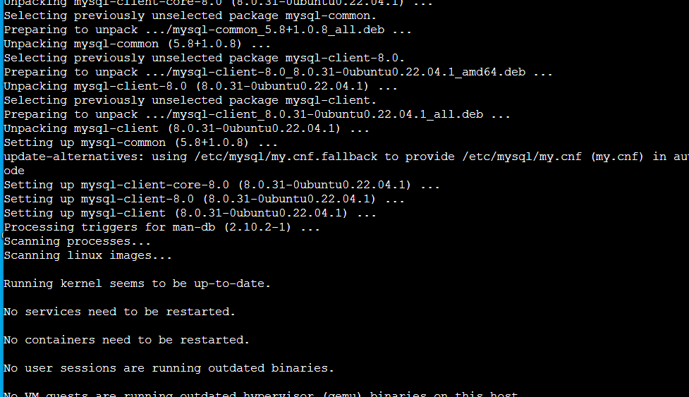

4. Create Inbound rule security Group with TCP port 3306 in Mysql Server

b connect mysql client on mysql server

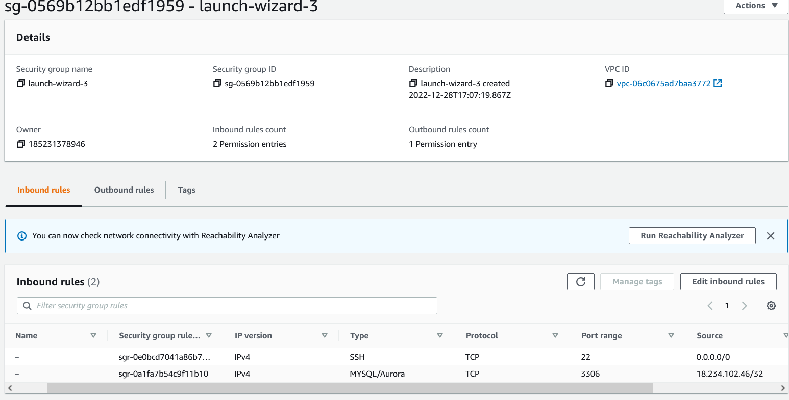

-`sudo mysql_secure_installation`
OPEN MYSQL utility
`sudo mysql`
CREATE USER 'remote_user'@'% IDENTIFIED WITH mysql_native_passowrd BY 'password';

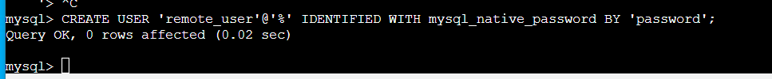

CREATE DATABASE test-db;

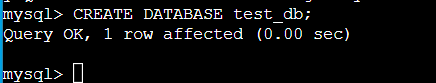

GRANT ALL ON test_db.* To 'remot_user'@'%'WITH GRANT OPTION;

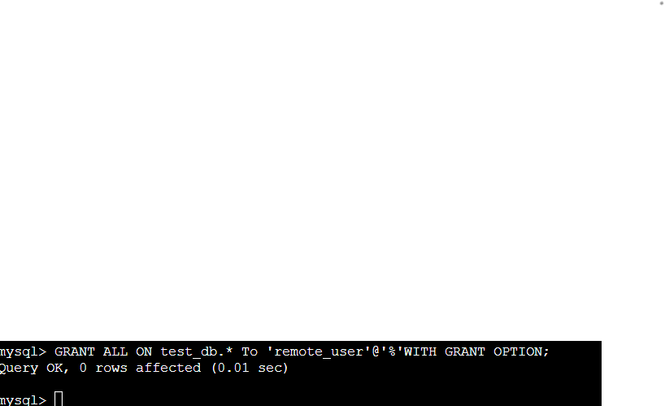

FLUSH PRIVILEGEs;

exit;

5. Configure MySQL server to allow connections from remote hosts

`sudo vim /etc/mysql/mysql.conf.d/mysqld.cnf`

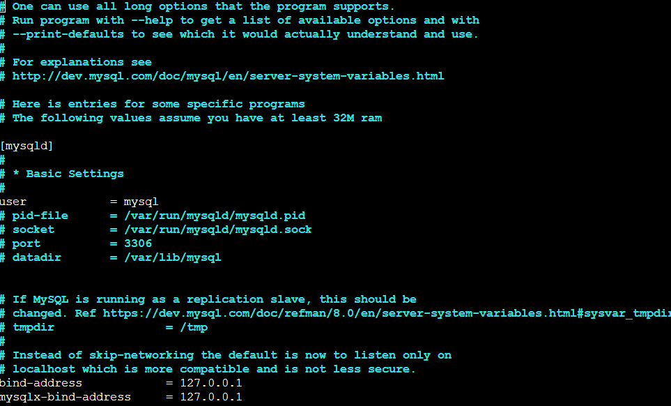

- Replace '127.0.0.1' to '0.0.0.0'
bind-address    =0.0.0.0

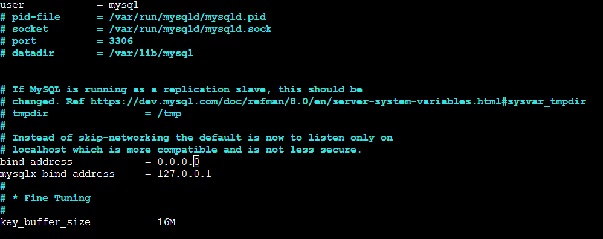

`sudo systemctl restart mysql`

6. On MySql client, connect remotely to Mysql Server without using ssh.Use mysql utility

-Inbound Role for Mysql/Aurora added

`sudo mysql -u remote_user -h 172.31.95.177 -p`

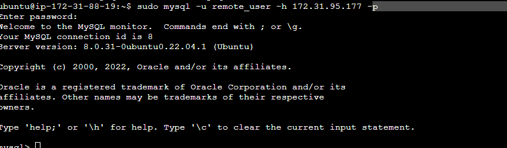

7. Confirm connection
`show databases;`

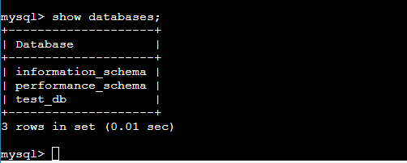
